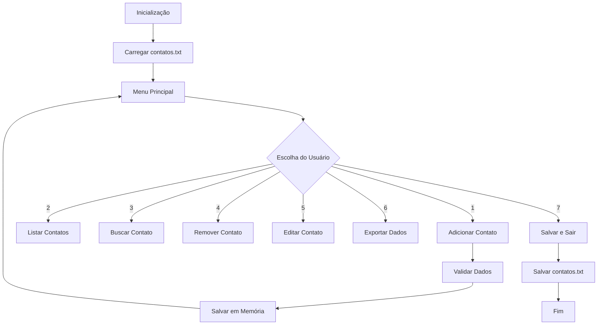

# 📞 Agenda de Contatos Python

<div align="center">


*Uma aplicação moderna e intuitiva para gerenciamento de contatos pessoais*

[Características](#-características) •
[Instalação](#-instalação) •
[Como Usar](#-como-usar) •
[Tecnologias](#-tecnologias-utilizadas) •
[Estrutura](#-estrutura-do-projeto)

</div>

---

## 🌟 Características

### Funcionalidades Principais
- ➕ **Adicionar Contatos** - Cadastre novos contatos com validação automática
- 📋 **Listar Contatos** - Visualize todos os contatos em tabelas elegantes
- 🔍 **Buscar Contatos** - Encontre contatos rapidamente pelo nome
- 🗑️ **Remover Contatos** - Exclua contatos com confirmação de segurança
- ✏️ **Editar Contatos** - Modifique informações de contatos existentes
- 📤 **Exportar Dados** - Exporte sua agenda para JSON ou CSV
- 💾 **Persistência Automática** - Dados salvos automaticamente

### Características Técnicas
- 🎨 **Interface Colorida** - Terminal estilizado com Rich
- 🛡️ **Validação de Dados** - Sistema robusto de validação com regex
- 📊 **Visualização em Tabelas** - Apresentação organizada dos dados
- 🔄 **Barra de Progresso** - Feedback visual durante operações
- 🎯 **Modularização** - Código organizado em módulos especializados
- 🚀 **Execução Simples** - Scripts automatizados para instalação

---

## 🚀 Instalação

### Pré-requisitos
- Python 3.7 ou superior
- pip (gerenciador de pacotes Python)

### Método 1: Instalação Automática (Windows)
```bash
# Clone o repositório
git clone https://github.com/AndreyBarfknecht/Agenda-de-Contatos-Python.git

# Entre no diretório
cd Agenda-de-Contatos-Python

# Execute o instalador (Windows)
instalar.bat
```

### Método 2: Instalação Manual
```bash
# Clone o repositório
git clone https://github.com/AndreyBarfknecht/Agenda-de-Contatos-Python.git

# Entre no diretório
cd Agenda-de-Contatos-Python

# Instale as dependências
pip install -r requirements.txt
```

### Dependências
- `rich` - Interface colorida e tabelas elegantes
- `pyfiglet` - Títulos em ASCII art

---

## 💻 Como Usar

### Execução Rápida (Windows)
```bash
executar.bat
```

### Execução Manual
```bash
python main.py
```

### Menu Principal
Após executar, você verá um menu interativo com as seguintes opções:

```
[1] Adicionar Contato
[2] Listar Contatos  
[3] Buscar Contato
[4] Remover Contato
[5] Editar Contato
[6] Exportar agenda para outros formatos
[7] Salvar e Sair
```

### Exemplos de Uso

#### 📝 Adicionando um Contato
```
--- Adicionar Novo Contato ---
Nome: João Silva
Telefone: (11) 99999-9999
E-mail: joao@email.com

✓ Contato adicionado com sucesso!
```

#### 🔍 Buscando Contatos
```
--- Buscar Contato ---
Nome: João

┏━━━━━━━━━━━━━━━━━━━━┳━━━━━━━━━━━━━━━━━━━━┳━━━━━━━━━━━━━━━━━━━━┓
┃ Nome               ┃ Telefone           ┃ E-mail             ┃
┡━━━━━━━━━━━━━━━━━━━━╇━━━━━━━━━━━━━━━━━━━━╇━━━━━━━━━━━━━━━━━━━━┩
│ João Silva         │ (11) 99999-9999    │ joao@email.com     │
└────────────────────┴────────────────────┴────────────────────┘
```

#### 📤 Exportando Dados
```
--- Exportar Agenda ---
[1] Exportar para JSON
[2] Exportar para CSV

Escolha: 1
✓ Agenda exportada para JSON com sucesso!
```

---

## 🛠️ Tecnologias Utilizadas

### Linguagem Principal
- **Python 3.x** - Linguagem de programação principal

### Bibliotecas Externas
- **Rich** - Interface de terminal moderna e colorida
- **PyFiglet** - Geração de texto em ASCII art

### Módulos Python Nativos
- **os** - Manipulação do sistema operacional
- **re** - Expressões regulares para validação
- **time** - Controle de tempo e pausas
- **csv** - Exportação para formato CSV
- **json** - Exportação para formato JSON

### Conceitos Aplicados
- **Programação Orientada a Objetos** - Estruturas de dados organizadas
- **Modularização** - Separação de responsabilidades
- **Tratamento de Exceções** - Robustez na execução
- **Validação de Dados** - Entrada segura de informações
- **Persistência de Dados** - Armazenamento permanente

---

## 📁 Estrutura do Projeto

```
Agenda-de-Contatos-Python/
├── 📄 main.py                   # Ponto de entrada da aplicação
├── 🎨 interface_usuario.py      # Interface e interação com usuário
├── 🔧 gerenciador_arquivos.py   # Operações de arquivo e exportação
├── ✅ validadores.py           # Validação de dados com regex
├── 📋 requirements.txt         # Dependências do projeto
├── 🚀 executar.bat            # Script de execução (Windows)
├── ⚙️ instalar.bat            # Script de instalação (Windows)
├── 📖 README.md               # Documentação do projeto
├── 🔒 .gitignore              # Arquivos ignorados pelo Git
├── 📝 .gitattributes          # Configurações do Git
└── 📊 dados/                  # Arquivos gerados automaticamente
    ├── contatos.txt           # Armazenamento principal
    ├── contatos.json          # Exportação JSON
    └── contatos.csv           # Exportação CSV
```

### Descrição dos Módulos

#### `main.py` 🚀
- **Função**: Ponto de entrada da aplicação
- **Responsabilidades**: Menu principal, controle de fluxo, integração dos módulos

#### `interface_usuario.py` 🎨
- **Função**: Interface visual e interação
- **Responsabilidades**: Menus, tabelas, cabeçalhos, entrada de dados

#### `gerenciador_arquivos.py` 🔧
- **Função**: Persistência e exportação de dados
- **Responsabilidades**: Carregar/salvar arquivos, exportar JSON/CSV

#### `validadores.py` ✅
- **Função**: Validação e sanitização de dados
- **Responsabilidades**: Padrões regex, validação de entrada

---

## 🎯 Funcionalidades Detalhadas

### Sistema de Validação
- **Nomes**: Aceita letras, acentos e espaços
- **Telefones**: Números, espaços, parênteses e hífens
- **E-mails**: Validação completa de formato de email

### Busca Inteligente
- Busca case-insensitive (maiúsculas/minúsculas)
- Suporte a múltiplos resultados
- Interface de seleção numerada

### Exportação de Dados
- **JSON**: Formato estruturado para backup
- **CSV**: Compatível com Excel e planilhas

### Experiência do Usuário
- Interface colorida e intuitiva
- Feedback visual com barras de progresso
- Confirmações de segurança para operações críticas
- Títulos estilizados em ASCII art

---

## 🔄 Fluxo de Dados



---

## 🎓 Objetivos Educacionais

Este projeto demonstra a aplicação prática de diversos conceitos fundamentais:

### Estruturas de Dados
- **Listas** para armazenamento de coleções
- **Dicionários** para dados estruturados
- **Strings** e manipulação de texto

### Programação Estruturada
- Modularização com funções especializadas
- Controle de fluxo com loops e condicionais
- Tratamento de exceções

### Manipulação de Arquivos
- Leitura e escrita de arquivos texto
- Serialização JSON
- Exportação CSV

### Interface de Usuário
- Design de menus intuitivos
- Feedback visual adequado
- Validação de entrada

---

## 🤝 Contribuições

Contribuições são bem-vindas! Para contribuir:

1. **Fork** o projeto
2. Crie uma **branch** para sua feature (`git checkout -b feature/AmazingFeature`)
3. **Commit** suas mudanças (`git commit -m 'Add some AmazingFeature'`)
4. **Push** para a branch (`git push origin feature/AmazingFeature`)
5. Abra um **Pull Request**

### Tipos de Contribuições
- 🐛 Correção de bugs
- ✨ Novas funcionalidades  
- 📚 Melhorias na documentação
- 🎨 Melhorias na interface
- ⚡ Otimizações de performance

---

## 📜 Licença

Este projeto está licenciado sob a Licença MIT - veja o arquivo [LICENSE](LICENSE) para detalhes.

---

## 👨‍💻 Autor

<div align="center">

**Andrey Barfknecht Rodrigues**

[](https://github.com/AndreyBarfknecht)
[](https://linkedin.com/in/andreybarfknecht)

*Desenvolvido com ❤️ para fins educacionais*

</div>

---

## 📞 Suporte

Encontrou um problema? Tem alguma sugestão?

- 🐛 [Reporte um bug](https://github.com/AndreyBarfknecht/Agenda-de-Contatos-Python/issues)
- 💡 [Sugira uma feature](https://github.com/AndreyBarfknecht/Agenda-de-Contatos-Python/issues)
- 📧 Entre em contato: [seu-email@domain.com]

---

<div align="center">

**⭐ Se este projeto te ajudou, deixe uma estrela! ⭐**

*Agenda de Contatos Python - Simplificando o gerenciamento de contatos*

</div>